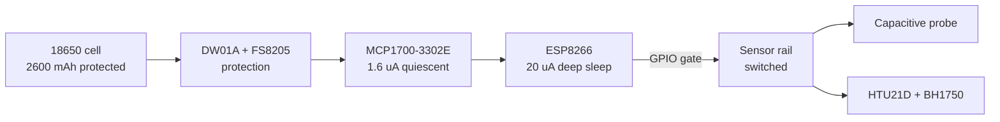

# Sensor Node — Hardware Design

A purpose-built replacement for the prebuilt DIY MORE boards. Every requirement
below comes from a failure this project actually recorded, not from a datasheet
wish-list.

## Design brief

Build a soil/climate node for an indoor potted plant that:

1. **Runs a year or more on one 18650.** The current boards manage ~7 days.
2. **Survives being watered.** One node has already been lost to it.
3. **Reports once a day** and confirms itself within seconds of a battery swap.
4. **Looks like an object you'd leave in a plant pot in a living room** — not a
   perfboard with a battery taped to it.

---

## What went wrong, and what it dictates

| Evidence | Root cause | Requirement |
|---|---|---|
| DIY MORE boards die in ~7 days; ~11.5 mA constant draw with the MCU asleep | AMS1117 LDO quiescent (5–10 mA) + power LED (2–5 mA) + always-on sensors | Sleep budget **< 50 µA**, every rail switchable |
| Ms Green stopped 2026-04-17 right after a morning watering; last soil reading jumped 562 → 268, then silence | Water ingress at the probe entry / connector | Sealed enclosure, **potted cable entry** |
| Batching cut WiFi uploads 24× with no change in battery life | WiFi was only ~3% of the budget — the baseline dominated | Fix the baseline in hardware; firmware is already done |
| Soil reads ~650 in air on one board, should be ~3430 | PCB trace defect on the ADC pin | Probe on a **connector**, field-replaceable |
| CO₂ board lost calibration when power was cut | ENS160 needs continuous power to hold its baseline | Separate always-on rail for the air-quality node variant |

The headline: **WiFi was never the problem.** The regulator and the LED were.
That is a hardware problem and it can only be fixed here.

---

## Power architecture

This is the whole design. Everything else is packaging.

**Why MCP1700 and not AMS1117.** 1.6 µA versus 5–10 mA is a factor of ~4000 on
the single largest term in the budget. This swap is already proven on the
NodeMCU node in this project — it is the reason that board was estimated at
60–90 days while the DIY MORE boards manage 7.

**No power LED.** Not fitted. An indicator that burns 3 mA around the clock to
tell you a sleeping device is asleep costs roughly 70 mAh a day — more than the
entire rest of the design. A single WS2812 pulsed briefly on wake can confirm
life when someone is actually looking; it draws nothing between flashes because
it sits on the switched rail.

**No USB-serial chip populated.** CH340/CP2102 leak via their rails even
unplugged. Bring out a 6-pin tag-connect / pogo header and use an external
FTDI adapter for flashing. Programming happens on a bench, not in a plant pot.

**Every sensor on a switched rail.** One GPIO through a P-channel MOSFET (not
direct from the pin — the capacitive probe's 5 mA is near the ESP8266's
comfortable per-pin limit). Firmware 2.1.0 already holds this pin low through
deep sleep via `gpio_hold_en`, which matters because a floating rail can
phantom-power the probe through its signal pin's ESD diodes.

### Power budget

| State | Current | Duration/day | Daily cost |
|---|---:|---:|---:|
| Deep sleep (MCU + LDO) | 22 µA | 23.99 h | 0.53 mAh |
| Sensor-read wake, radio off ×23 | 25 mA | ~1 s each | 0.16 mAh |
| WiFi upload wake ×1 | 80 mA | ~15 s | 0.33 mAh |
| **Circuit total** | | | **≈ 1.0 mAh** |

On 2200 mAh usable that is ~2200 days of *circuit* draw — which is not the real
answer. **At this point lithium self-discharge becomes the limiting factor:**
2–3 %/month on a 2600 mAh cell is ~1.7–2.6 mAh/day, roughly double the circuit
itself.

**Realistic life: ~600–700 days.** Call it 18 months to two years, cell ageing
included. Past this point further electrical optimisation is pointless — you
would be optimising against chemistry, not circuitry.

---

## Sensor suite

| Function | Part | Bus | Note |
|---|---|---|---|
| Soil moisture | Capacitive v2.0 probe | ADC | Not resistive — resistive probes electrolyse and corrode within weeks |
| Temp + humidity | HTU21D | I²C 0x40 | Proven in this project; SHT40 is the better modern pick if sourcing new |
| Light | BH1750 | I²C 0x23 | `ONE_TIME_HIGH_RES_MODE`, auto-sleeps between reads |
| Air quality *(variant)* | ENS160 + AHT21 | I²C 0x52 / 0x38 | **Must stay on its own always-on rail** — cutting power resets its baseline |
| Battery telemetry | 2× 1 MΩ divider + MOSFET | ADC | **Currently missing and it cost us a diagnosis** |

**Add the battery divider.** When four boards went dark this month there was no
way to tell a flat cell from a WiFi outage — the two are indistinguishable from
the server side, and that ambiguity is still unresolved. A 1 MΩ/1 MΩ divider
gated by the same sensor MOSFET costs ~2 µA while active and nothing while
asleep, and turns "is it dead?" into a chart.

---

## Enclosure

Two parts, because they have opposite requirements.

### Probe (in the soil)

The commodity capacitive probe is **not actually sealed** — the silkscreen is
not a coating, and the exposed traces and header at the head wick moisture.
This is the likely mechanism behind the Ms Green loss.

- Conformal coat (or pot in epoxy) everything above the marked waterline
- Heat-shrink the head and the first 20 mm of cable with adhesive-lined tubing
- JST-PH pigtail so a corroded probe is a one-minute swap, not a rebuild

### Body (above the soil)

- **Form:** a slim vertical stake, ~95 × 30 × 20 mm, angled crown. It should
  read as a plant marker, not as electronics. Matte PETG or ASA — PLA creeps in
  a sunny window and yellows under UV.
- **Sealing:** target IP54. Not immersion — splash and drip, which is the real
  threat from a watering can. Silicone O-ring in a machined groove on the lid.
- **Cable entry:** the only breach in the shell, and the exact point that failed
  before. M8 gland, strain-relieved, potted with neutral-cure silicone.
- **Breathing:** a Gore-style ePTFE vent patch. A fully sealed box pumps moist
  air in and out as it heats and cools each day and condenses inside; the vent
  equalises pressure while blocking liquid.
- **Desiccant:** a 1 g silica sachet in a retained pocket.
- **Service:** four captive M2 screws from the rear. The cell changes without
  tools touching the sealed sensor side.
- **Antenna:** keep the ESP module's antenna keep-out clear of the cell and of
  any copper — a 18650 sitting across the antenna is a real range killer.

### Placement

The light sensor must see what the plant sees, so it sits on the crown facing
up. The temp/humidity sensor must *not* sit next to the MCU or the cell — both
are heat sources and will read high. Put it on a thermally isolated tab with a
slot relief, vented to ambient.

---

## Bill of materials

| Item | Part | Qty | ~Unit |
|---|---|---:|---:|
| MCU | ESP8266 (ESP-12F) | 1 | £1.80 |
| Regulator | MCP1700-3302E/TO | 1 | £0.45 |
| Cell | 18650 2600 mAh protected | 1 | £4.50 |
| Holder | Keystone 1043 | 1 | £1.10 |
| Charger | TP4056 + DW01A protection | 1 | £0.60 |
| Rail switch | P-MOSFET (DMG2301L) + 100 kΩ | 1 | £0.25 |
| Soil probe | Capacitive v2.0 | 1 | £1.50 |
| Temp/humidity | HTU21D (or SHT40) | 1 | £2.20 |
| Light | BH1750 GY-302 | 1 | £1.30 |
| Vent | ePTFE patch | 1 | £0.40 |
| Gland | M8 cable gland | 1 | £0.35 |
| Seal | Silicone O-ring | 1 | £0.15 |
| Enclosure | PETG/ASA print | 1 | £1.20 |
| **Total** | | | **≈ £15.80** |

Against a DIY MORE board at roughly £6 — but that board dies weekly and has
already lost one node to water. Three battery swaps of saved effort pays it back.

---

## Migration from the current fleet

The firmware is already there; only the board changes.

1. **Validate the thesis first.** Measure deep-sleep current on one existing
   board (10 Ω series resistor, read the drop in DC volts — see
   `battery-investigation.md`). Expect ~11 mA. Confirm before committing to a
   PCB spin.
2. **Cheap intermediate test.** On one DIY MORE: remove the power LED, cut the
   AMS1117 out and feed 3.3 V from an MCP1700 straight to the rail. Re-measure.
   If that lands near 50 µA, the architecture above is proven with a soldering
   iron and no PCB order.
3. **Then** spin the board. The firmware needs no changes — `FIRMWARE_VERSION`
   reporting means the new nodes will be distinguishable from the old ones in
   the data automatically, so battery life per revision can finally be compared
   directly.

## Open questions

- Which cell holder chemistry tolerates a 2-year install without contact
  corrosion in a humid pot environment?
- Is the ENS160 variant worth a second always-on rail, or better as a
  mains-powered room node rather than a per-plant node?
- Does the crown-mounted light sensor need a diffuser to avoid reading direct
  sunbeam spikes rather than ambient?
